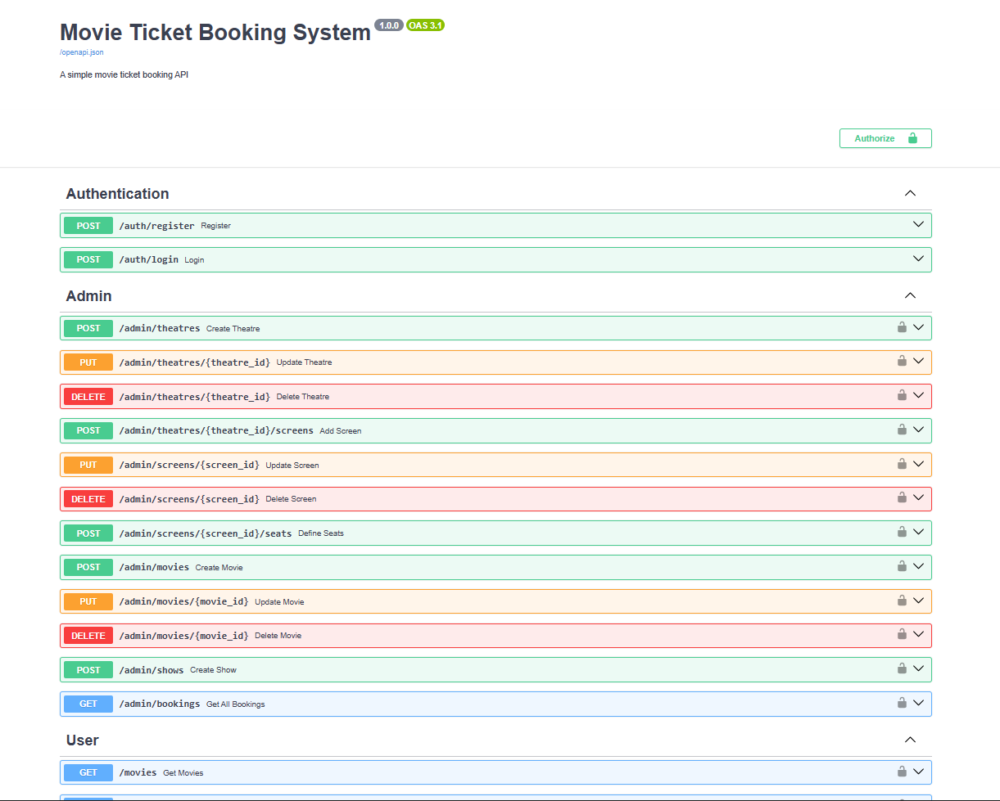

# Movie Ticket Booking System

A simple FastAPI-based movie ticket booking system with JWT authentication and role-based access control.

## Setup Instructions

### 1. Install Dependencies

```bash
uv pip install -r requirements.txt
```

### 2. Configure Environment Variables

Make sure your `.env` file has the following:

```
MONGO_URI=your_mongo_db_uri
DATABASE_NAME=movie_booking_db
SECRET_KEY=your-secret-key-change-this-in-production
ALGORITHM=HS256
ACCESS_TOKEN_EXPIRE_MINUTES=30
```

### 3. Run the Application

```bash
uv run main.py
```

Or using uvicorn directly:

```bash
uvicorn main:app --reload
```

The API will be available at `http://localhost:8000`

## API Documentation

Visit `http://localhost:8000/docs` for interactive Swagger documentation.

## Default Usage Flow

### 1. Register an Admin User

```bash
curl -X POST "http://localhost:8000/auth/register" \
  -H "Content-Type: application/json" \
  -d '{
    "email": "admin@example.com",
    "password": "admin123",
    "name": "Admin User",
    "role": "admin"
  }'
```

### 2. Register a Regular User

```bash
curl -X POST "http://localhost:8000/auth/register" \
  -H "Content-Type: application/json" \
  -d '{
    "email": "user@example.com",
    "password": "user123",
    "name": "Regular User",
    "role": "user"
  }'
```

### 3. Login (Admin or User)

```bash
curl -X POST "http://localhost:8000/auth/login" \
  -H "Content-Type: application/json" \
  -d '{
    "email": "admin@example.com",
    "password": "admin123"
  }'
```

This will return a JWT token. Use this token in the `Authorization` header for protected routes:

```
Authorization: Bearer <your_token>
```

### 4. Admin: Create Theatre

```bash
curl -X POST "http://localhost:8000/admin/theatres" \
  -H "Authorization: Bearer <admin_token>" \
  -H "Content-Type: application/json" \
  -d '{
    "name": "PVR Cinemas",
    "location": "Koramangala",
    "city": "Bangalore"
  }'
```

### 5. Admin: Add Screen to Theatre

```bash
curl -X POST "http://localhost:8000/admin/theatres/<theatre_id>/screens" \
  -H "Authorization: Bearer <admin_token>" \
  -H "Content-Type: application/json" \
  -d '{
    "name": "Screen 1",
    "theatre_id": "<theatre_id>"
  }'
```

### 6. Admin: Define Seats for Screen

```bash
curl -X POST "http://localhost:8000/admin/screens/<screen_id>/seats" \
  -H "Authorization: Bearer <admin_token>" \
  -H "Content-Type: application/json" \
  -d '{
    "seat_numbers": ["A1", "A2", "A3", "A4", "A5", "B1", "B2", "B3", "B4", "B5"]
  }'
```

### 7. Admin: Add Movie

```bash
curl -X POST "http://localhost:8000/admin/movies" \
  -H "Authorization: Bearer <admin_token>" \
  -H "Content-Type: application/json" \
  -d '{
    "title": "Inception",
    "description": "A mind-bending thriller",
    "duration_minutes": 148,
    "genre": "Sci-Fi",
    "language": "English",
    "release_date": "2010-07-16"
  }'
```

### 8. Admin: Schedule Show

```bash
curl -X POST "http://localhost:8000/admin/shows" \
  -H "Authorization: Bearer <admin_token>" \
  -H "Content-Type: application/json" \
  -d '{
    "movie_id": "<movie_id>",
    "screen_id": "<screen_id>",
    "show_date": "2025-11-01",
    "show_time": "18:00",
    "price": 250.0
  }'
```

### 9. User: Browse Movies

```bash
curl -X GET "http://localhost:8000/movies" \
  -H "Authorization: Bearer <user_token>"
```

### 10. User: View Shows

```bash
curl -X GET "http://localhost:8000/shows" \
  -H "Authorization: Bearer <user_token>"
```

### 11. User: Check Seat Availability

```bash
curl -X GET "http://localhost:8000/shows/<show_id>/seats" \
  -H "Authorization: Bearer <user_token>"
```

### 12. User: Book Tickets

```bash
curl -X POST "http://localhost:8000/bookings" \
  -H "Authorization: Bearer <user_token>" \
  -H "Content-Type: application/json" \
  -d '{
    "show_id": "<show_id>",
    "seats": ["A1", "A2"]
  }'
```

### 13. User: View Booking History

```bash
curl -X GET "http://localhost:8000/bookings" \
  -H "Authorization: Bearer <user_token>"
```

### 14. User: Cancel Booking

```bash
curl -X DELETE "http://localhost:8000/bookings/<booking_id>" \
  -H "Authorization: Bearer <user_token>"
```

### 15. Admin: View All Bookings

```bash
curl -X GET "http://localhost:8000/admin/bookings" \
  -H "Authorization: Bearer <admin_token>"
```

## Database Schema

### Users Collection
```json
{
  "_id": "ObjectId",
  "email": "string",
  "password": "hashed_string",
  "name": "string",
  "role": "admin | user"
}
```

### Movies Collection
```json
{
  "_id": "ObjectId",
  "title": "string",
  "description": "string",
  "duration_minutes": "integer",
  "genre": "string",
  "language": "string",
  "release_date": "string"
}
```

### Theatres Collection
```json
{
  "_id": "ObjectId",
  "name": "string",
  "location": "string",
  "city": "string"
}
```

### Screens Collection
```json
{
  "_id": "ObjectId",
  "name": "string",
  "theatre_id": "string",
  "seats": ["A1", "A2", "A3", ...]
}
```

### Shows Collection
```json
{
  "_id": "ObjectId",
  "movie_id": "string",
  "screen_id": "string",
  "show_date": "string",
  "show_time": "string",
  "price": "float",
  "available_seats": ["A1", "A2", ...]
}
```

### Bookings Collection
```json
{
  "_id": "ObjectId",
  "user_id": "string",
  "show_id": "string",
  "seats": ["A1", "A2"],
  "total_price": "float",
  "booking_date": "string",
  "status": "confirmed | cancelled"
}
```

## Features

✅ JWT-based authentication  
✅ Role-based access control (Admin/User)  
✅ Theatre and screen management  
✅ Movie management  
✅ Show scheduling  
✅ Seat booking with availability check  
✅ Prevent double booking  
✅ Booking history  
✅ Cancel bookings  
✅ Background email notifications  
✅ Global error handling  

## Project Structure

```
movie-booking-system/
├── main.py              # Application entry point
├── config.py            # Configuration settings
├── database.py          # Database connection
├── models/              # Pydantic models
│   ├── user.py
│   ├── movie.py
│   ├── theatre.py
│   └── booking.py
├── routers/             # API routes
│   ├── auth.py          # Authentication endpoints
│   ├── admin.py         # Admin endpoints
│   └── user.py          # User endpoints
└── utils/               # Helper functions
    ├── auth.py          # Auth utilities
    └── email.py         # Email utilities
```